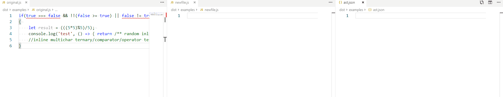

[](http://makeapullrequest.com) [](http://www.gnu.org/licenses/gpl-3.0)


# Javascript Compiling Tokenizer
>Give your Javascript the token of love

Hello, welcome to JavaScript tokenizer

This project has the sole purpose of tokenizing JavaScript by traversing a given file (stringified) and generating an abstract syntax tree from the resulting tokenization process

JCT does not worry about loading the files or what to do with the files after pushing them into an abstract syntax tree it simply concerns itself with the process of generating an AST

Other projects utilise this projects and take the resulting abstract syntax tree and transpire the JavaScript accordingly

For example require to ecma takes the abstract syntax tree generated from this code and uses it to transpile code that contains the old require import system into the new es6 import system




## usage

Install it

```
    npm i javascript-compiling-tokenizer
```

Import it

```
    import { LexicalAnalyzer, Generator } from 'javascript-compiling-tokenizer';
```

Initialize it

```
    const tokenizer = new LexicalAnalyzer(options)

    //options only have one property.... 'verbose' [boolean]
```

Tokenize it it
```
    const syntaxTree = tokenizer().start(fileAsString);
```

Turn it back into javascript
```
    const js = new Generator().start(syntaxTree);
```

Test it
```
    npm test
```

options

```
{
    verbose: boolean //will log to console
    thirdPartyParsingTests: Array<(char: string, current: number, input: string) => IThirdPartyParsingResult> = [];
}
```

## Injecting your own third party lexical checks
Its as simple as providing an array of functions. The functions are given the following arguments: <br/><br/>
``` char:string, current:number, input:string ```

char is the string at the current position, current is the index of the current position in the input string and input is a stringified version of the whole file.

The function must return an object ```(IThirdPartyParsingResult)``` containing:

```
{
    payload: {type: 'coolnew type', value: 'the value'} //the token
    current: number //new cursor position after going through this function
}
```

Third party lexical checks are always performed first.

## Transforming tokens into Javascript

```
   new Generator().start(tokens)
```

This will return a string representation of the tokens provided. all you have to do is pipe it into a file.

## Dev notes

The tokenizer will recurse in the following conditions:

- if it finds an opening parenthesis ```(```
- if it finds an opening code block ```{```
- if it finds an opening array ```[```
- if it finds a declaration ``` const, let, var ```


## Examples
> There are more examples of this being used on a react file, normal js file and a file containing the 'old' 'defines' method to import things in ```./tests/beforeandafter```

## Gotchas

- This tokenizer wont parse files correctly if variables are not declared properly. If you declare variables without a declaration statement such as ```const```, ```var```, ```let```. Then this tokenizer is not for you.
- Parser doesn't support comma separated declarations. ```let var1,var2,var3,var4;``` will not parse correctly.

#### Some regex

``` js
   import * as _ from 'underscore';
   import * as colors from 'colors';

   const CARRIAGE_RETURN = /\n/;
   const EOL = /\r/;
   const WHITESPACE = /\s/;
   const NUMBERS = /[0-9]/;
   const DECLARABLE_CHARACTERS = /[A-Za-z_.$]/i;
```

The AST

``` json
   {
    "tokens": [{
        "type": "name",
        "value": "import"
    }, {
        "type": "operator",
        "value": "*"
    }, {
        "type": "name",
        "value": "as"
    }, {
        "type": "name",
        "value": "_"
    }, {
        "type": "name",
        "value": "from"
    }, {
        "type": "string",
        "value": "underscore"
    }, {
        "type": "statementSeperator",
        "value": ";"
    }, {
        "type": "carriagereturn",
        "value": 1
    }, {
        "type": "name",
        "value": "import"
    }, {
        "type": "operator",
        "value": "*"
    }, {
        "type": "name",
        "value": "as"
    }, {
        "type": "name",
        "value": "colors"
    }, {
        "type": "name",
        "value": "from"
    }, {
        "type": "string",
        "value": "colors"
    }, {
        "type": "statementSeperator",
        "value": ";"
    }, {
        "type": "carriagereturn",
        "value": 2
    }, {
        "type": "carriagereturn",
        "value": 3
    }, {
        "type": "const",
        "value": [{
            "type": "name",
            "value": "CARRIAGE_RETURN"
        }, {
            "type": "assigner",
            "value": "="
        }, {
            "type": "assignee",
            "value": "/\\n/"
        }]
    }, {
        "type": "carriagereturn",
        "value": 4
    }, {
        "type": "const",
        "value": [{
            "type": "name",
            "value": "EOL"
        }, {
            "type": "assigner",
            "value": "="
        }, {
            "type": "assignee",
            "value": "/\\r/"
        }]
    }, {
        "type": "carriagereturn",
        "value": 5
    }, {
        "type": "const",
        "value": [{
            "type": "name",
            "value": "WHITESPACE"
        }, {
            "type": "assigner",
            "value": "="
        }, {
            "type": "assignee",
            "value": "/\\s/"
        }]
    }, {
        "type": "carriagereturn",
        "value": 6
    }, {
        "type": "const",
        "value": [{
            "type": "name",
            "value": "NUMBERS"
        }, {
            "type": "assigner",
            "value": "="
        }, {
            "type": "assignee",
            "value": "/[0-9]/"
        }]
    }, {
        "type": "carriagereturn",
        "value": 7
    }, {
        "type": "const",
        "value": [{
            "type": "name",
            "value": "DECLARABLE_CHARACTERS"
        }, {
            "type": "assigner",
            "value": "="
        }, {
            "type": "assignee",
            "value": "/[A-Za-z_.$]/i"
        }]
    }],
    "current": 211
}
```

### The generated code
 (its the same...)
``` js
   import * as _ from 'underscore';
   import * as colors from 'colors';

   const CARRIAGE_RETURN = /\n/;
   const EOL = /\r/;
   const WHITESPACE = /\s/;
   const NUMBERS = /[0-9]/;
   const DECLARABLE_CHARACTERS = /[A-Za-z_.$]/i;
```

### Trixie code

```js
   if(true === false && !!(false >= true) || false != true)
   {
      let result = (((5*5)%5)/5);
      console.log('test', () => { return /** random inline comment */ !!true})
      //inline multichar ternary/comparator/operator test
   }
```

AST

```json
   {
    "tokens": [{
        "type": "name",
        "value": "if"
    }, {
        "type": "params",
        "value": [{
            "type": "name",
            "value": "true "
        }, {
            "type": "operator",
            "value": "==="
        }, {
            "type": "assignee",
            "value": "false"
        }, {
            "type": "operator",
            "value": "&&"
        }, {
            "type": "operator",
            "value": "!!("
        }, {
            "type": "name",
            "value": "false "
        }, {
            "type": "operator",
            "value": ">="
        }, {
            "type": "name",
            "value": "true"
        }]
    }, {
        "type": "operator",
        "value": "||"
    }, {
        "type": "name",
        "value": "false "
    }, {
        "type": "operator",
        "value": "!="
    }, {
        "type": "name",
        "value": "true"
    }, {
        "type": "operator",
        "value": ")"
    }, {
        "type": "carriagereturn",
        "value": "\n"
    }, {
        "type": "codeblock",
        "value": [{
            "type": "carriagereturn",
            "value": "\n"
        }, {
            "type": "let",
            "value": [{
                "type": "name",
                "value": "result "
            }, {
                "type": "assigner",
                "value": "="
            }, {
                "type": "params",
                "value": [{
                    "type": "params",
                    "value": [{
                        "type": "params",
                        "value": [{
                            "type": "assignee",
                            "value": "5*5"
                        }]
                    }, {
                        "type": "operator",
                        "value": "%"
                    }, {
                        "type": "name",
                        "value": "5"
                    }]
                }, {
                    "type": "operator",
                    "value": "/"
                }, {
                    "type": "name",
                    "value": "5"
                }]
            }, {
                "type": "statementseperator",
                "value": ";"
            }]
        }, {
            "type": "carriagereturn",
            "value": "\n"
        }, {
            "type": "name",
            "value": "console.log"
        }, {
            "type": "params",
            "value": [{
                "type": "string",
                "value": "'test'"
            }, {
                "type": "seperator",
                "value": ","
            }, {
                "type": "params",
                "value": []
            }, {
                "type": "assigner",
                "value": "="
            }, {
                "type": "assignee",
                "value": ">"
            }, {
                "type": "codeblock",
                "value": [{
                    "type": "name",
                    "value": "return "
                }, {
                    "type": "multilinecomment",
                    "value": " ** random inline comment "
                }, {
                    "type": "operator",
                    "value": "!!"
                }, {
                    "type": "name",
                    "value": "true"
                }]
            }]
        }, {
            "type": "carriagereturn",
            "value": "\n"
        }, {
            "type": "carriagereturn",
            "value": "\n"
        }, {
            "type": "inlinecomment",
            "value": "//inline multichar ternary/comparator/operator test"
        }, {
            "type": "carriagereturn",
            "value": "\n"
        }]
    }],
    "current": 225
}
```
The output

```js
if(true === false && !!(false >= true) || false != true)
{
    let  result = (((5*5)%5)/5);
    console.log('test', () => { return /** random inline comment */ !!true})
    
//inline multichar ternary/comparator/operator test
}
```


### Some string literals

``` js
   const string = `something ${1 + 2 + 3}`;
   const string2 = `something ${(true) ? 'x' : 'y'}`;
   const string3 = `something
   another ${'x'}
   new line ${1 + 2 + 3}
   test`;
```

the AST

```json
   {
   {
    "tokens": [{
        "type": "carriagereturn",
        "value": 1
    }, {
        "type": "const",
        "value": [{
            "type": "name",
            "value": "string"
        }, {
            "type": "assigner",
            "value": "="
        }, {
            "type": "stringLiteral",
            "value": "something ${1 + 2 + 3}"
        }]
    }, {
        "type": "carriagereturn",
        "value": 2
    }, {
        "type": "const",
        "value": [{
            "type": "name",
            "value": "string"
        }, {
            "type": "number",
            "value": "2"
        }, {
            "type": "assigner",
            "value": "="
        }, {
            "type": "stringLiteral",
            "value": "something ${(true) ? 'x' : 'y'}"
        }]
    }, {
        "type": "carriagereturn",
        "value": 3
    }, {
        "type": "const",
        "value": [{
            "type": "name",
            "value": "string"
        }, {
            "type": "number",
            "value": "3"
        }, {
            "type": "assigner",
            "value": "="
        }, {
            "type": "stringLiteral",
            "value": "something\nanother ${'x'}\nnew line ${1 + 2 + 3}\ntest"
        }]
    }],
    "current": 163
}
```


#### A class
``` js
    export default class {
    constructor() {

    }
    randomFn() {
        return 'this is awesome'
    }
}
```

The AST for that class

``` json
    {
    "tokens": [{
        "type": "name",
        "value": "export"
    }, {
        "type": "name",
        "value": "default"
    }, {
        "type": "name",
        "value": "class"
    }, {
        "type": "codeblock",
        "value": [{
            "type": "carriagereturn",
            "value": 1
        }, {
            "type": "name",
            "value": "constructor"
        }, {
            "type": "params",
            "value": []
        }, {
            "type": "codeblock",
            "value": [{
                "type": "carriagereturn",
                "value": 2
            }, {
                "type": "carriagereturn",
                "value": 3
            }]
        }, {
            "type": "carriagereturn",
            "value": 4
        }, {
            "type": "name",
            "value": "randomFn"
        }, {
            "type": "params",
            "value": []
        }, {
            "type": "codeblock",
            "value": [{
                "type": "carriagereturn",
                "value": 5
            }, {
                "type": "name",
                "value": "return"
            }, {
                "type": "string",
                "value": "this is awesome"
            }, {
                "type": "carriagereturn",
                "value": 6
            }]
        }, {
            "type": "carriagereturn",
            "value": 7
        }]
    }],
    "current": 107
}
```

### React app file
> Note, you can obviously make it a bit smarter for complex frameworks by injecting your own lexer functions. They will be called first and can tell the rest of the app where to continue from once your magical function has done its magic

``` js

    import React from 'react';
    import ReactDOM from 'react-dom';
    import { Provider } from 'react-redux';
    import { createStore } from 'redux';

    import App from './components/App';
    import OfflineMode from 'react-off-the-grid';
    import reducers from './reducers';

    import './index.css';

    const store = createStore(reducers);
    ReactDOM.render(
    <div className="ui container" style={{ marginTop: '3em' }}>
        <OfflineMode saveName="MOOSE_FILE" store={store} />
        <Provider store={ store }>
        <App/>
    </Provider>
    </div>, document.getElementById('root'));
```

The AST

``` json
    {
   "tokens":[
      {
         "type":"carriagereturn",
         "value":1
      },
      {
         "type":"name",
         "value":"import"
      },
      {
         "type":"name",
         "value":"React"
      },
      {
         "type":"name",
         "value":"from"
      },
      {
         "type":"string",
         "value":"react"
      },
      {
         "type":"statementSeperator",
         "value":";"
      },
      {
         "type":"carriagereturn",
         "value":2
      },
      {
         "type":"name",
         "value":"import"
      },
      {
         "type":"name",
         "value":"ReactDOM"
      },
      {
         "type":"name",
         "value":"from"
      },
      {
         "type":"string",
         "value":"react-dom"
      },
      {
         "type":"statementSeperator",
         "value":";"
      },
      {
         "type":"carriagereturn",
         "value":3
      },
      {
         "type":"name",
         "value":"import"
      },
      {
         "type":"codeblock",
         "value":[
            {
               "type":"name",
               "value":"Provider"
            }
         ]
      },
      {
         "type":"name",
         "value":"from"
      },
      {
         "type":"string",
         "value":"react-redux"
      },
      {
         "type":"statementSeperator",
         "value":";"
      },
      {
         "type":"carriagereturn",
         "value":4
      },
      {
         "type":"name",
         "value":"import"
      },
      {
         "type":"codeblock",
         "value":[
            {
               "type":"name",
               "value":"createStore"
            }
         ]
      },
      {
         "type":"name",
         "value":"from"
      },
      {
         "type":"string",
         "value":"redux"
      },
      {
         "type":"statementSeperator",
         "value":";"
      },
      {
         "type":"carriagereturn",
         "value":5
      },
      {
         "type":"carriagereturn",
         "value":6
      },
      {
         "type":"name",
         "value":"import"
      },
      {
         "type":"name",
         "value":"App"
      },
      {
         "type":"name",
         "value":"from"
      },
      {
         "type":"string",
         "value":"./components/App"
      },
      {
         "type":"statementSeperator",
         "value":";"
      },
      {
         "type":"carriagereturn",
         "value":7
      },
      {
         "type":"name",
         "value":"import"
      },
      {
         "type":"name",
         "value":"OfflineMode"
      },
      {
         "type":"name",
         "value":"from"
      },
      {
         "type":"string",
         "value":"react-off-the-grid"
      },
      {
         "type":"statementSeperator",
         "value":";"
      },
      {
         "type":"carriagereturn",
         "value":8
      },
      {
         "type":"name",
         "value":"import"
      },
      {
         "type":"name",
         "value":"reducers"
      },
      {
         "type":"name",
         "value":"from"
      },
      {
         "type":"string",
         "value":"./reducers"
      },
      {
         "type":"statementSeperator",
         "value":";"
      },
      {
         "type":"carriagereturn",
         "value":9
      },
      {
         "type":"carriagereturn",
         "value":10
      },
      {
         "type":"name",
         "value":"import"
      },
      {
         "type":"string",
         "value":"./index.css"
      },
      {
         "type":"statementSeperator",
         "value":";"
      },
      {
         "type":"carriagereturn",
         "value":11
      },
      {
         "type":"carriagereturn",
         "value":12
      },
      {
         "type":"declaration",
         "value":[
            {
               "type":"name",
               "value":"store"
            },
            {
               "type":"operator",
               "value":"="
            },
            {
               "type":"name",
               "value":"createStore"
            },
            {
               "type":"params",
               "value":[
                  {
                     "type":"name",
                     "value":"reducers"
                  }
               ]
            }
         ]
      },
      {
         "type":"carriagereturn",
         "value":13
      },
      {
         "type":"name",
         "value":"ReactDOM.render"
      },
      {
         "type":"params",
         "value":[
            {
               "type":"carriagereturn",
               "value":14
            },
            {
               "type":"operator",
               "value":"<"
            },
            {
               "type":"name",
               "value":"div"
            },
            {
               "type":"name",
               "value":"className"
            },
            {
               "type":"operator",
               "value":"="
            },
            {
               "type":"string",
               "value":"ui container"
            },
            {
               "type":"name",
               "value":"style"
            },
            {
               "type":"operator",
               "value":"="
            },
            {
               "type":"codeblock",
               "value":[
                  {
                     "type":"codeblock",
                     "value":[
                        {
                           "type":"name",
                           "value":"marginTop"
                        },
                        {
                           "type":"operator",
                           "value":":"
                        },
                        {
                           "type":"string",
                           "value":"3em"
                        }
                     ]
                  }
               ]
            },
            {
               "type":"operator",
               "value":">"
            },
            {
               "type":"carriagereturn",
               "value":15
            },
            {
               "type":"operator",
               "value":"<"
            },
            {
               "type":"name",
               "value":"OfflineMode"
            },
            {
               "type":"name",
               "value":"saveName"
            },
            {
               "type":"operator",
               "value":"="
            },
            {
               "type":"string",
               "value":"MOOSE_FILE"
            },
            {
               "type":"name",
               "value":"store"
            },
            {
               "type":"operator",
               "value":"="
            },
            {
               "type":"codeblock",
               "value":[
                  {
                     "type":"name",
                     "value":"store"
                  }
               ]
            },
            {
               "type":"operator",
               "value":"/"
            },
            {
               "type":"operator",
               "value":">"
            },
            {
               "type":"carriagereturn",
               "value":16
            },
            {
               "type":"operator",
               "value":"<"
            },
            {
               "type":"name",
               "value":"Provider"
            },
            {
               "type":"name",
               "value":"store"
            },
            {
               "type":"operator",
               "value":"="
            },
            {
               "type":"codeblock",
               "value":[
                  {
                     "type":"name",
                     "value":"store"
                  }
               ]
            },
            {
               "type":"operator",
               "value":">"
            },
            {
               "type":"carriagereturn",
               "value":17
            },
            {
               "type":"operator",
               "value":"<"
            },
            {
               "type":"name",
               "value":"App"
            },
            {
               "type":"operator",
               "value":"/"
            },
            {
               "type":"operator",
               "value":">"
            },
            {
               "type":"carriagereturn",
               "value":18
            },
            {
               "type":"operator",
               "value":"<"
            },
            {
               "type":"operator",
               "value":"/"
            },
            {
               "type":"name",
               "value":"Provider"
            },
            {
               "type":"operator",
               "value":">"
            },
            {
               "type":"carriagereturn",
               "value":19
            },
            {
               "type":"operator",
               "value":"<"
            },
            {
               "type":"operator",
               "value":"/"
            },
            {
               "type":"name",
               "value":"div"
            },
            {
               "type":"operator",
               "value":">"
            },
            {
               "type":"seperator",
               "value":","
            },
            {
               "type":"name",
               "value":"document.getElementById"
            },
            {
               "type":"params",
               "value":[
                  {
                     "type":"string",
                     "value":"root"
                  }
               ]
            }
         ]
      },
      {
         "type":"statementSeperator",
         "value":";"
      }
   ],
   "current":559
}
```

You got this far... You might aswell clone it :D
