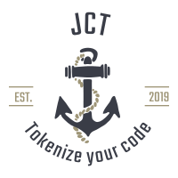

[](http://makeapullrequest.com) [](http://www.gnu.org/licenses/gpl-3.0)



# Javascript Compiling Tokenizer
>Give your Javascript the token of love

Hello, welcome to JavaScript tokenizer

This project has the sole purpose of tokenizing JavaScript by traversing the files and generating an abstract syntax tree from the resulting tokenization process

JCT does not worry about loading the files or what to do with the files after pushing them into an abstract syntax tree it simply concerns itself with the process of generating an AST

Other projects utilise this projects and take the resulting abstract syntax tree and transpire the JavaScript accordingly

For example require to ecma takes the abstract syntax tree generated from this code and uses it to transpile code that contains the Old require import system into the new es6 import system

## usage

Install it

```
    npm i javascript-compiling-tokenizer
```

Import it

```
    import LexicalAnalyzer from 'javascript-compiling-tokenizer';
```

Initialize it

```
    const tokenizer = new LexicalAnalyzer(options)

    //options only have one property.... 'verbose' [boolean]
```

Run it
```
    const syntaxTree = tokenizer().start(fileAsString);
```

Test it
```
    npm test
```

## Coming soon

documentation on the AST layout

The tokenizer will recurse in the following conditions:

- if it finds an opening parenthesis ```(```
- if it finds an opening code block ```{```
- if it finds an opening array ```[```
- if it finds a declaration ``` const, let, var new ```

The code generate will consist of:

```
TODO

```